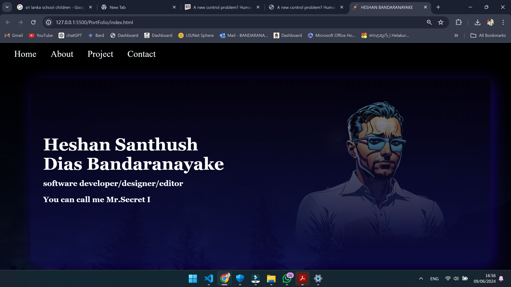
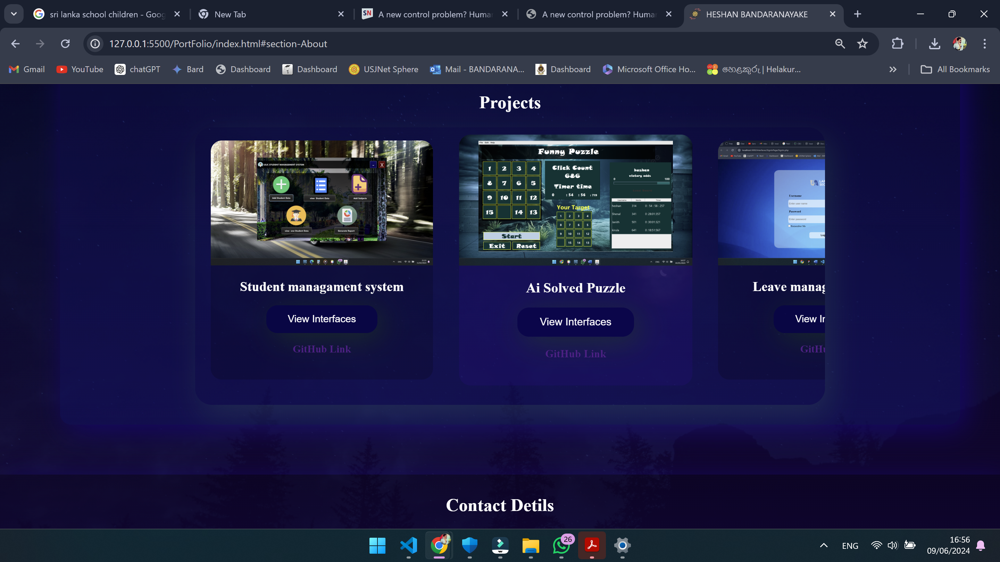

<!-- https://PortFolio.github.io -->

# Heshan Bandaranayake's Portfolio Website

Welcome to my personal portfolio website! 
This site showcases my projects, skills, and professional experiences as a web developer,designer and  editor. Explore my work and get to know more about my journey in the tech industry.

## Table of Contents
- [Introduction](#introduction)
- [Features](#features)
- [Technologies Used](#technologies-used)
- [Usage](#usage)
- [Screenshots](#screenshots)
- [Contact](#contact)
- [License](#license)

## Features
- Responsive design for all devices
- Interactive project showcase
- Downloadable resume
- Contact form for direct communication

## Technologies Used
- HTML5
- CSS3
- JavaScript (ES6+)
<!-- - React.js
- Node.js
- Express.js
- MongoDB -->

<!-- ## Installation
To run this project locally, follow these steps:

1. Clone the repository: -->

<!-- git clone https://github.com/yourusername/portfolio-website.git -->

<!-- 2. Navigate to the project directory: -->
<!-- 3. Install the dependencies: -->
<!-- 4. Start the development server: -->

## Usage
Visit [https://sunhesh12.github.io/PortPoliyo/](https://sunhesh12.github.io/PortPoliyo/) to explore my portfolio. 
- Navigate through the menu to view different sections such as Projects, About Me, Skills, and Contact.
- Click on project thumbnails to view detailed information about each project.
- Use the contact form to get in touch with me directly.

## Screenshots

## Contact
Feel free to reach out to me via email at [hsdbandaranayake@gmail.com](mailto:hsdbandaranayake@gmail.com) or connect with me on [LinkedIn](https://www.linkedin.com/in/santhush-bandaranayake).

## License
<!-- This project is licensed under the MIT License - see the [LICENSE](LICENSE) file for details. -->

 
